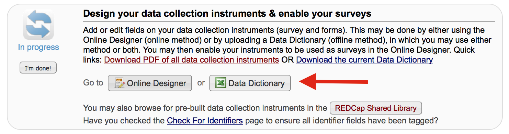
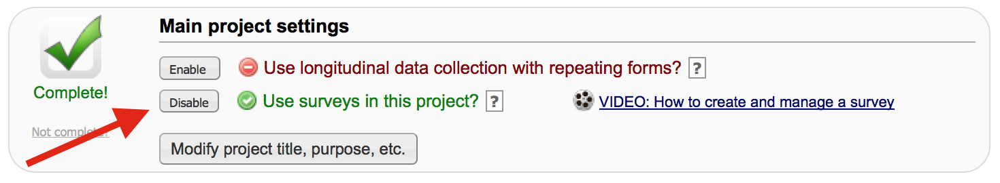
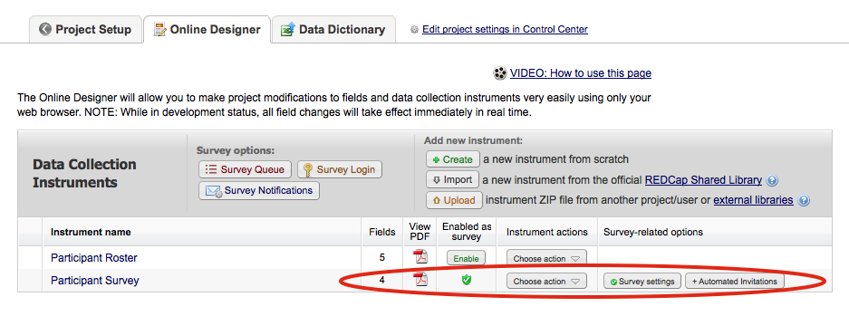
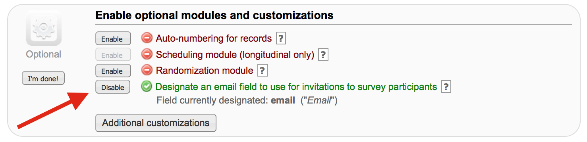
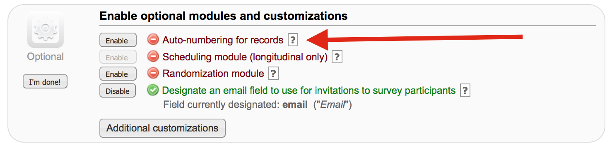

# Instructions

By now, you should have access to two projects in the [test instance of
REDCap](https://redcap2.nubic.northwestern.edu):

1. **`REDCap API CDSI Dev Talk`**: (Read-only) This is the project for which you
just filled your participation survey. Your response (including your
secretphrase) and the responses from everyone else are all  stored in this
project. This will be referred to as the `Master Project`.
2. **`CDSI Challenge for $YOURNETID`**: A blank project that you will use to survey
all the other challenge participants. Feel free to rename this project. This
will be referred to as `Your Personal Project`.

Your task which is due on **Tuesday January 12, 2016 at midnight** is to build a
survey in Your Personal Project and send that survey to everyone whose name is
in the Master Project. To ensure that we have survey participation, you also
have to respond to 50% or more of the surveys that you receive from other
participants. 


## Building Your Personal Project

### Defining the Forms and Data Elements

Like you, everyone whose name ends up in the Master Project has provided a
secretphrase while filling the participation survey. You will need to use REDCap
to send each person a personalized survey link which displays to them the
secretphrase that they have provided. This is to assure them that the survey is sent
by a fellow participant. 

To support that, you will need to build Your Personal Project in a way 
way that captures the names, email, and secretphrase of your colleagues. 

You will also need to build a data capture form and enable it as a survey that goes
out to everyone based on a designated email field. (I will describe below how to
enable a form as a survey and how to designate an email field.)

The **GOOD NEWS** is that I already made a template that you can use to
create all this. It is a CSV file (Data Dictionary in REDCap's lingo) which
defines all the metadata associated with forms and their fields in a project.
REDcap allows you to download and upload Data Dictionary associated with
projects for fast sharing and creation of forms.

The Data Dictionary file that I created is in this github repository:  
`resources/Individual_Project_Datadictionary_template.csv`
(link [here](resources/Individual_Project_Datadictionary_template.csv)).  

Go to Your Personal Project and click on **Project Setup**. In the portion that
says "Design your data collection instruments" click on the **Data Dictionary**
button. 



It will take you to a page where you can upload the template CSV file that I
made you. Be sure to commit your changes.

If all goes well, Your Personal Project should now contain 2 forms.

`Participant Roster` form with the following fields:

* `record_id`
* `first_name`
* `last_name`
* `email`
* `agree_y`
* `secretphrase`

`Participant Survey` form with the following fields:

* `show_info`: a descriptive field as described below
* `sample_1`: a simple text field that you will need to modify
* `sample_2`: a simple text field that you will need to modify
* `sample_3`: a simple text field that you will need to modify

### Personalizing Your Survey Using the Secretphrase

A good way to achieve personalization in the survey form is to use a question of
type 'descriptive' which is basically just text with no input field. (e.g. the
`show_info` above) You can use REDCap's piping syntax to display to them the
contents of the other fields. For example the text that you would show in that
'descriptive' text can have the following value: 

```
Hello [first_name] [last_name], your secret phrase is: 
[secretphrase]
```

*The square brackets are REDCap's syntax to pipe values from the other fields.*

### Enabling the Survey

You will need to enable surveys within Your Personal Project to be able to send
online surveys. Once you do that, your project setting page should look like this:



Then enable the specific `Participant Survey` form as a survey in the **Online
Designer**. 



*Note: keep the `Participant Roster` form as is. You're importing data into that
form through the application and not via an online survey*

Finally, designate the `email` field in the `Participant Roster` form as the
survey invitation field. This way you can use REDCap's built in survey managment
interface to create and send personalized invitations containing a survey link
unique to each person. Once you designate your survey invitation field, Your
Personal Project set up page should look like this:



### Build Your Own Survey Questions

You have what you need in terms of infrastructure. Now it's up to you to build
the survey. Use the **Online Designer** to do that. Here are some guidelines:

* Use at least 3 types of fields in the list below. Try to also to include
input validation so you learn the data model behind the various types of
questions. 
    * Text: numeric or integer, try range validation e.g. age >18
    * Text: date or datetime with the calendar "now" option
    * Text: email, zip code, ...
    * Note box
    * Calculated field: check out all the functions you can utilize in those
    * Single-answer multiple choice: dropdown or radio button or yes-no
    * Multiple-choice: check box
    * Slider: visual analog scale e.g. can be used for things like "on a scale
of silent to hyperventillation with a paper bag, how would you describe
your breathing when the Star Wars opening credits started?"
    * File upload
    * Signature field
    * Descriptive text where you show off that you know their names or other
info about them in hidden fields of the same record
* Keep it short -- no longer than 1-2 minutes to fill. This is a holiday project
for us, not a chore.
* Be creative and pick an interesting topic. Remember that participants are not
obligated to fill every survey so try to be competitive in luring them into
filling your survey. You can upload photos and a logo to your survey. 
* Remember that this is not a de-identified survey, so people
would not be comfortable answering private questions or questions about their
health.

Close the survey (you can automatically set the survey to go offline on the
survey setting page) by midnight on January 12, 2016. 

Please prepare a short summary sharing what you learned about your colleagues
from your questionnaire e.g. that 60% of the foreign born participants have
never had eggnog or 80% of folks whose desks are in Rubloff have gone harrowingly
uncaffeinated in the afternoons since the espresso machine broke down.

Note that you don't need to wait until the end of data collection to to prepare
your analysis. You can export the data into CSV files (or as JSON stream if
you're using the API) at any time during data capture. If you automate the
analysis pipeline, then you can run tentative reports of the progress at any
point during your data capture.

## Entering the Roster and Keeping it Current

To send your survey to everyone who wants to participate in this challenge, you
will need to find a way to copy all the records in The Master Projects with
those in Your Local Project. Others may join after you have started, so you will
also need to find a way synchronize those two lists going forward.

**Option 1**  
You can always do it by hand, since you have read access via the browser
interface to the Master Project. This might be tedious if too many people
participate.

**Option 2**  
You can also use the import/export modules. In the template I created, I lined
up the variable names in the `Participant Roster` form with the relevant subset
of variables in the Master Project. So a simple export (of those variables only
- see above) from the Master Project and the subsequent import of that
  spreadsheet into Your Local Project should do the trick. Note that if the
records exists, REDCap will simply ignore them during the bulk import unless the
values have changed for some reason.

**Option 3**  
You can use the API. There is ample documentation in REDCap on how to use that.
Request an API token from within Your Local Project and one of the superusers of
that instance will grant it to you. You can then use it in any programming
language to access it via https. Note that the api subdirectory, like the REDCap
instance at NU, requires VPN access if you're off campus.

### Setting the Record ID to not be automatically numbered

Since a `record_id` variable is canonically required in every REDCap project
and an associated value is required for every record, you will
need to either auto-generate one or rely on a `record_id` value set elsewhere.
The latter is the easier option if you rely on the value assigned to the records
in The Master Project. 

Disable auto-numbering from the **Project Set up** and you should see the
setting below.



*Note: this is a common workflow to create study IDs in one master registry and
then to create and sync records with a key reference in derivative projects*

### Don't SPAM!

If you recall from your second survey, you will need to explicitly agree to
receiving emails as part of this challenge to the email you provided. 

One constraint that I am imposing in this challenge (and one which mirrors a
real-life scenario in which research subjects need to explicitly agree to being
contacted) is that you check for that agreement in the Master Project. 

There may be people there who have not yet completed the second survey or who
have simply abandoned the challenge at that point for not wanting to receive surveys. 

**DON'T SEND SURVEY INVITATIONS FROM YOUR LOCAL PROJECT TO USERS WHO HAVE NOT
YET AGREED TO RECEIVE EMAILS**

Functionally, you can store and verify that agreement in the `agree_y` field
which I have created in both the Master Project and Your Local Project.

### Updates, FAQs, and Demo Code -- Pull Requests Welcome

Watch this repository on GitHub for any updates. This requires having a Github
account.

Create an issue if you have a question. Other watchers will receive
notification.

I will make any fixes or add clarifications or demo code by creating a pull
request so you get notifications when I do that.

If you want to share some code or provide some feedback, feel free to do so by a
pull request. To keep things organized, create a subfolder named by your NetID under
`participant_contribution` folder and put your content there. You can provide
your report of the outcomes there in a MarkDown document.

